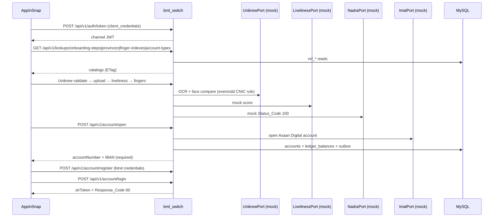
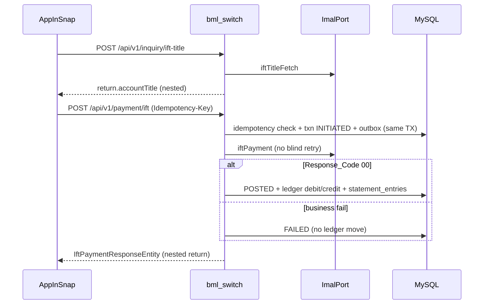
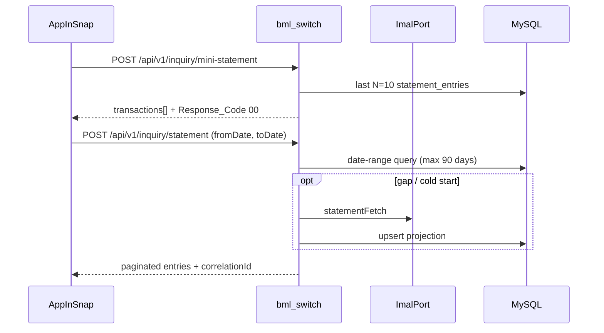

# System Overview — Bank Al Murqarmah Integration Switch (`bml_switch`)

**Status:** Binding architecture (plan phase)  
**Date:** 2026-09-28  
**Stack:** Spring Boot 3.x modular monolith · MySQL 8 · Docker Compose · OpenAPI 3.0 · JWT

---

## 1. Four parties

| Party | Role |
|-------|------|
| **AppInSnap** | Builds the Bank Al Murqarmah mobile banking app; sole consumer of Switch public REST APIs |
| **bml_switch (THIS PROJECT)** | Integration Switch / middle layer: AssanPay-compatible façade, auth, audit, idempotency, orchestration |
| **iMAL (Azentio / Path Solutions)** | Islamic core banking (accounts, balances, transfers, statements). Official APIs **not yet available** → Mock first |
| **Bank Al Murqarmah** | Bank / compliance / config owner (channel codes, IMD, limits, secrets). Not a runtime caller in MVP |

```
┌─────────────┐     HTTPS + Channel JWT + strToken      ┌──────────────────────────────┐
│  AppInSnap  │ ───────────────────────────────────────►│  bml_switch (Spring Boot)    │
│  Mobile App │   /api/v1/** AssanPay + Lookups         │  Auth · Lookups · Onboarding │
└─────────────┘                                         │  Payments · Inquiry · Audit  │
                                                        │           │                  │
                                                        │      ImalPort (hexagonal)    │
                                                        │           │                  │
                                                        │    MockImalAdapter (MVP)     │
                                                        │    RealImalAdapter (later)   │
                                                        └───────────┬──────────────────┘
                                                                    │ JDBC
                                                                    ▼
                                                              ┌──────────┐
                                                              │  MySQL   │
                                                              │ core+ref_*│
                                                              └──────────┘
```

**Topology decision:** One Spring Boot service + MySQL. Mock iMAL is **in-process** (`MockImalAdapter`) behind `ImalPort`. **Lookups/master data** are first-class AppInSnap APIs (not internal-only). Optional separate `mock-imal` container is deferred.

---

## 2. Design intent

`Mobile App (AppInSnap) → Integration Switch (THIS) → iMAL Core Banking`

AppInSnap previously integrated with a switch that exposed **AssanPay Third-Party API** JSON shapes. We preserve those request/response bodies under `/api/v1/...` so AppInSnap can integrate **now**. When real iMAL docs arrive, only the adapter implementation changes.

---

## 3. Sequence — Digital onboarding (happy path)



**Path A (new Asaan):** KYC → **open** → **register** → login. **Path B (existing account):** register → login (skip open).  
**Saga states:** `STARTED → DOCS_UPLOADED → CNIC_VALIDATED → LIVELINESS_OK → BIOMETRIC_OK → ACCOUNT_OPENED → REGISTERED | MANUAL_REVIEW | REJECTED`

---

## 4. Sequence — IFT (intra-bank transfer)



**Status machine:** `INITIATED → POSTED | FAILED`; `POSTED → REVERSED` (compensating only).

---

## 5. Sequence — IBFT (interbank via mock 1LINK façade)

**Mandatory client sequence:** load banks → title → pay → status.

```mermaid
sequenceDiagram
  participant M as AppInSnap
  participant S as bml_switch
  participant I as ImalPort (mock 1LINK)
  participant DB as MySQL

  M->>S: GET /api/v1/lookups/banks?active=true&supportsIbft=true
  S->>DB: ref_banks
  S-->>M: bank picker (imd, names) + ETag
  M->>S: GET /api/v1/lookups/purpose-of-payment
  S-->>M: purpose codes
  M->>S: POST /api/v1/inquiry/ibft-title (toIBAN + toIMD)
  S->>I: ibftTitleFetch
  S-->>M: IBFTTitleFetchResponse.return (double-nested)
  M->>S: POST /api/v1/auth/otp/send → verify (otp=1234)
  S-->>M: otpTicket
  M->>S: POST /api/v1/payment/ibft (otpTicket + Idempotency-Key)
  S->>DB: validate toIMD; INITIATED
  S->>I: ibftPayment
  S-->>M: flat Response_Code / Response_Desc
  M->>S: POST /api/v1/inquiry/ibft-status (poll 2s ≤30s)
  S-->>M: POSTED / FAILED
```

---

## 6. Sequence — Statement



---

## 7. Cross-cutting flows

| Concern | Mechanism |
|---------|-----------|
| Correlation | `X-Correlation-Id` minted/propagated; echoed on every response |
| Idempotency | Header `Idempotency-Key` or composite `intRefNum`+`stan` → `idempotency_keys` |
| Envelope injection | Switch overwrites bank config fields from env (never trust mobile) |
| Resilience | Resilience4j circuit breaker on `ImalPort` / vendor ports |
| Audit | Append-only `audit_log`; mask CNIC; never log tokens/passwords/biometrics |
| Feature flag | `MOCK_IMAL=true` (MVP default) → `MockImalAdapter` |
| Lookups | Channel JWT; `ref_*` tables; ETag / catalogVersion |

---

## 8. Related docs

- [01-bounded-contexts.md](./01-bounded-contexts.md)
- [02-imal-mock-api-contract.md](./02-imal-mock-api-contract.md)
- [03-appinsnap-facing-api-contract.md](./03-appinsnap-facing-api-contract.md)
- [04-lookups-master-data.md](./04-lookups-master-data.md)
- [../handoff/appinsnap-integration-cookbook.md](../handoff/appinsnap-integration-cookbook.md)
- [../plans/MASTER-PLAN.md](../plans/MASTER-PLAN.md)
- [../plans/gap-analysis.md](../plans/gap-analysis.md)
- [../security/security-design.md](../security/security-design.md)
- [../devops/docker-runtime.md](../devops/docker-runtime.md)
